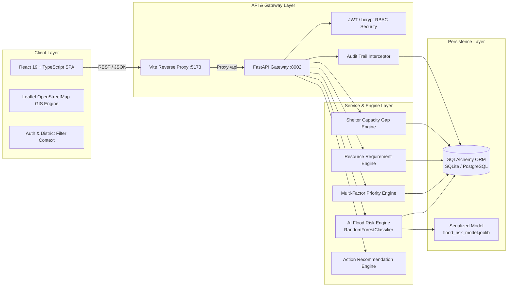

# System Architecture: JalRakshak Bihar

## 1. Architectural Philosophy
JalRakshak Bihar is engineered as an industrial-grade, mission-critical Decision Support System (DSS) for disaster management coordinators. It adheres to strict software engineering standards:
- **Separation of Concerns**: Decoupled presentation, domain business logic, data persistence, and machine learning inference.
- **Fail-Safe Operation**: Resilient SQLite fallback when PostgreSQL clusters are unavailable, ensuring frontline functionality even during connectivity disruptions.
- **Explainability First**: No black-box deep learning. Every prediction surfaces the exact physical inputs and quantitative weights that produced the output.
- **Audit Traceability**: State mutating operations (e.g. inventory adjustments, shelter occupancy shifts, road closures) are intercepted and logged to an immutable audit ledger.

---

## 2. Component Diagram



---

## 3. Directory Layout & Modular Structure

```
6x Innovate/
├── backend/
│   ├── app/
│   │   ├── core/
│   │   │   ├── config.py           # Pydantic Settings, Environment variables, CORS
│   │   │   └── security.py         # Passlib/bcrypt password hashing, PyJWT tokens
│   │   ├── database/
│   │   │   ├── session.py          # SQLAlchemy engine, connection pooling, get_db
│   │   │   ├── base.py             # Declarative base
│   │   │   └── seed_data.py        # Authentic Bihar flood scenario seeding
│   │   ├── models/                 # SQLAlchemy ORM database models
│   │   │   ├── user.py             # User accounts & RBAC roles
│   │   │   ├── location.py         # Bihar settlement monitoring stations
│   │   │   ├── hydrology.py        # Water gauge & rainfall telemetry
│   │   │   ├── risk.py             # ML risk score & factor JSON
│   │   │   ├── resource.py         # Boats, teams, rations inventory
│   │   │   ├── shelter.py          # Relief shelter capacity & occupancy
│   │   │   ├── road_status.py      # Field road closures & route segments
│   │   │   ├── incident.py         # Active emergency incidents
│   │   │   ├── alert.py            # Operational threshold alerts
│   │   │   └── audit_log.py        # Immutable audit records
│   │   ├── schemas/                # Pydantic validation schemas
│   │   ├── services/               # Core business & computation engines
│   │   │   ├── risk_service.py     # Inference execution & explanation formatting
│   │   │   ├── priority_service.py # Multi-factor ranking calculation
│   │   │   ├── resource_service.py # Planning requirement & shortage math
│   │   │   ├── shelter_service.py  # Headroom & district gap detection
│   │   │   ├── recommendation_service.py # Grounded action plans
│   │   │   ├── alert_service.py    # Alert generation & acknowledgments
│   │   │   └── audit_service.py    # Centralized audit logger
│   │   ├── ml/                     # ML training, feature pipeline, serialization
│   │   │   ├── feature_pipeline.py # Hydrological feature engineering
│   │   │   ├── train_model.py      # Random Forest trainer & metrics exporter
│   │   │   ├── inference.py        # Explainable inference service singleton
│   │   │   ├── flood_risk_model.joblib # Serialized model binary
│   │   │   └── model_metrics.json  # Precision, recall, ROC-AUC, importances
│   │   ├── routers/                # REST API endpoints
│   │   └── main.py                 # FastAPI application root & lifespan
│   ├── tests/                      # Pytest automated test suite (18 tests)
│   ├── requirements.txt            # Locked backend dependencies
│   └── Dockerfile                  # Production container definition
│
├── frontend/
│   ├── src/
│   │   ├── components/
│   │   │   ├── common/             # Header, Sidebar, ScenarioModal
│   │   │   ├── map/                # Leaflet map layers & SVG markers
│   │   │   └── risk/               # "Why is this area at risk?" modal
│   │   ├── context/                # AuthContext & quick role switcher
│   │   ├── pages/                  # Command center route pages
│   │   │   ├── DashboardPage.tsx   # Executive 5-question triage briefing
│   │   │   ├── MapPage.tsx         # Tactical GIS map with layers
│   │   │   ├── RiskAnalysisPage.tsx# ML explainability & raw sensor inspector
│   │   │   ├── PriorityPage.tsx    # Multi-factor priority ranking & weights
│   │   │   ├── ResourcesPage.tsx   # Requirement calculator & inventory edit
│   │   │   ├── SheltersPage.tsx    # Shelter capacity gap management
│   │   │   ├── RoadsPage.tsx       # Field road accessibility reporting
│   │   │   ├── IncidentsPage.tsx   # Active field incident register
│   │   │   ├── AlertsPage.tsx      # Structured emergency alerts
│   │   │   ├── AuditLogPage.tsx    # Complete government audit trail
│   │   │   └── DataSourcesPage.tsx # Data provenance & transparency directory
│   │   ├── services/
│   │   │   └── api.ts              # Typed API client with auto auth headers
│   │   ├── types/
│   │   │   └── index.ts            # TypeScript domain interfaces
│   │   ├── index.css               # Command Center design system
│   │   ├── App.tsx                 # Router & application shell
│   │   └── main.tsx                # React DOM entrypoint
│   ├── index.html                  # SEO & Typography metadata
│   ├── vite.config.ts              # Proxy & bundler configuration
│   ├── package.json                # Frontend dependencies
│   └── Dockerfile                  # Nginx production build
│
├── docker-compose.yml              # Multi-container orchestration
├── README.md                       # Comprehensive guide
├── ARCHITECTURE.md                 # Architecture documentation
├── DATA_DICTIONARY.md              # Database schemas & attributes
├── AI_METHODOLOGY.md               # Model training & explainability math
└── DEMO.md                         # Demonstration walkthrough script
```

---

## 4. Security Architecture & RBAC Matrix
The platform enforces role-based access control via JWT claims:
- **`ADMIN`**: State Emergency Operations Directors. Can update all resources, acknowledge alerts, trigger simulation scenarios, and inspect system audit logs.
- **`DISTRICT_OFFICIAL`**: District Magistrates and DEOC Officers. Can modify district resource inventories, shelter occupancies, and review local priorities.
- **`FIELD_OFFICER`**: SDRF / NDRF Patrol Commanders. Authorized to submit field road blockage reports and operational incident notifications.
- **`VIEW_ONLY`**: Observers and public information officers. Granted read-only view of dashboard metrics, maps, and reports.
