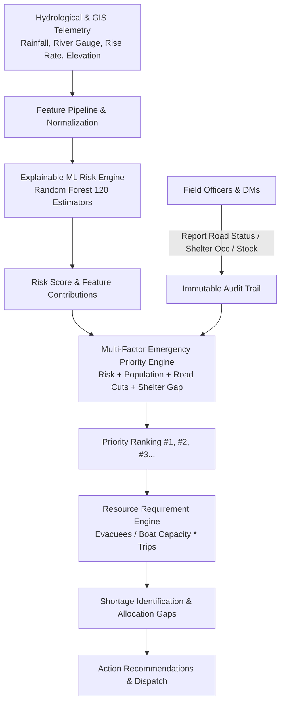

# JalRakshak Bihar (जल रक्षक बिहार)
### AI-Powered Flood Intelligence & Emergency Response Decision Support Platform

[](https://www.python.org/)
[](https://fastapi.tiangolo.com/)
[](https://react.dev/)
[](https://scikit-learn.org/)
[]()
[]()

> **CRITICAL DECISION-SUPPORT MANDATE**  
> *"When multiple locations are affected simultaneously and emergency resources are limited, how can officials identify which locations need attention first and make faster, evidence-based response decisions?"*

---

## 1. Problem
Bihar experiences chronic, catastrophic flooding every monsoon season across its major river basins (Kosi, Bagmati, Gandak, Ganga, Burhi Gandak, Kamala Balan). When barrage discharges, embankment breaches, and heavy rains strike concurrently, emergency command centers face severe operational fog:
- **Generic Prediction Overload**: Broad flood forecasts fail to explain *which specific settlement* will become isolated first.
- **Resource Allocation Guesswork**: Relief coordinators are forced to guess how many motorized rescue boats, medical kits, and ration packets are required.
- **Dynamic Field Blindness**: Road cuts and shelter capacity deficits are often discovered too late on the ground.

## 2. Why Bihar
- **Topography**: Flat alluvial plains dropping from 68m elevation in the northwest to 32m in the southeast, creating natural low-lying depressions (*chaurs*) that drain slowly.
- **Transboundary Discharge**: Unpredictable peak surges from Nepal catchments into the Kosi ("Sorrow of Bihar") and Gandak systems.
- **High Population Density**: Over 1,100 people/km² live in close proximity to major river embankments.

## 3. The JalRakshak Solution
JalRakshak Bihar implements an evidence-based decision support workflow:

$$\mathbf{DATA} \longrightarrow \mathbf{RISK\ ANALYSIS} \longrightarrow \mathbf{EXPLANATION} \longrightarrow \mathbf{PRIORITY} \longrightarrow \mathbf{RESOURCE\ GAP} \longrightarrow \mathbf{RECOMMENDED\ ACTION}$$

### Core Product Principles:
1. **Never Invent Real-World Facts**: Every number shown on screen is explicitly categorized as (1) Real/Public dataset, (2) User/Official field operational input, (3) Calculated mathematical formula, (4) Machine Learning prediction, or (5) Simulated/demonstration data.
2. **Prominent Demo Badges**: Simulated operational data is labeled with a `DEMO / SIMULATED DATA` badge.
3. **Decision Support, Not Autonomous Command**: The AI provides explainable logistical recommendations with transparent calculations; final operational decisions remain with authorized officials.

---

## 4. Architecture Overview



- **Backend**: Python 3.13 / FastAPI, SQLAlchemy 2.0, SQLite (default zero-dependency) / PostgreSQL ready, Pydantic v2.
- **AI/ML**: Scikit-Learn `RandomForestClassifier` (120 trees), tree-based feature marginal attributions, SHAP-calibrated explainability.
- **Frontend**: React 19, TypeScript, Vite, Leaflet GIS, Lucide icons, tactical high-contrast Command Center UI.

---

## 5. First Screen Experience: The 5 Core Operational Questions
Upon opening the platform, the dashboard immediately answers:
1. **WHERE is the situation getting worse?**  
   Identifies the `#1` critical hotspot (e.g., *Kunauli, Kosi Embankment, Supaul* with surge rate `+0.65m / 3h`).
2. **HOW severe is it?**  
   Shows exact count of Active Critical Zones, High Risk Zones, and total population potentially exposed.
3. **WHY is that location high priority?**  
   Displays the primary drivers: river gauge +1.2m above danger level, rapid rise rate, NH-27 cut off, and local shelter deficit.
4. **WHAT resources are needed?**  
   Shows the planning estimate for rescue boats, trained teams, rations, and water pouches.
5. **WHERE is there a resource shortage?**  
   Highlights the exact gap between Required vs Available inventory in the target district.

---

## 6. Transparent Mathematical Formulations

### Population Exposure Calculation:
$$\text{Estimated Exposed Population} = \text{Census Population} \times \left(\frac{\text{Predicted Flood Exposure Probability}}{100}\right)$$
*Labeled explicitly as a MODEL ESTIMATE.*

### Resource Requirement Planning Formula:
$$\text{Evacuation Target} = \text{Estimated Exposed Population} \times \text{Evacuation Ratio (\% (default 30\%))}$$
$$\text{Capacity per Boat} = \text{Boat Capacity (default 20 persons)} \times \text{Expected Trips (default 2 trips)} = 40\text{ persons/boat}$$
$$\text{Required Boats} = \left\lceil \frac{\text{Evacuation Target}}{\text{Capacity per Boat}} \right\rceil$$
$$\text{Shortage} = \max\left(0, \text{Required Boats} - \text{Available Boats}\right)$$

### Multi-Factor Priority Score:
$$\text{Priority Score} = (w_{\text{risk}} \cdot S_{\text{risk}}) + (w_{\text{pop}} \cdot S_{\text{pop}}) + (w_{\text{road}} \cdot P_{\text{road}}) + (w_{\text{shelter}} \cdot P_{\text{shelter}}) + (w_{\text{rise}} \cdot S_{\text{rise}})$$
*Where weights default to: Risk 30%, Population 25%, Road Cut 15%, Shelter Gap 15%, River Rise 15%. Officials can adjust weights dynamically.*

---

## 7. Role-Based Access Control (RBAC)

| Role | Permissions | Test Credentials |
|---|---|---|
| **ADMIN** | Full system access, scenario triggers, audits | `admin` / `admin123` |
| **DISTRICT_OFFICIAL** | Triage, update boat/shelter inventory, recommendations | `dm_supaul` / `supaul123` |
| **FIELD_OFFICER** | Submit field road status & incident reports | `field_officer` / `field123` |
| **VIEW_ONLY** | Read-only observation of dashboard & maps | `viewer` / `view123` |

*A Quick Role Switcher is available in the top navigation header for judges and evaluators.*

---

## 8. Quick Start Instructions

### Prerequisites
- Python 3.10+ (tested on Python 3.13)
- Node.js 18+ (tested on Node v24.4)
- npm 9+

### Option A: Local Execution (Zero Setup)

#### 1. Backend
```bash
# In project root
cd backend
python -m pip install -r requirements.txt


# Run test suite to verify all mathematical formulas & API endpoints
python -m pytest tests/ -v

# Train ML model & generate artifacts (if not pre-trained)
python -m app.ml.train_model

# Seed database with Bihar flood scenarios
python -m app.database.seed_data

# Launch FastAPI server on port 8002
python -m uvicorn app.main:app --host 127.0.0.1 --port 8002
```

#### 2. Frontend
```bash
# Open a second terminal
cd frontend
npm install
npm run dev -- --host 127.0.0.1
```
Open **`http://localhost:5173`** in your browser.

---

### Option B: Docker Compose
```bash
docker-compose up --build
```
- Frontend: `http://localhost:5173`
- Backend API Docs: `http://localhost:8002/docs`

---

## 9. Primary End-to-End Demo Flow (Step-by-Step)
1. **Open Command Center (`/dashboard`)**:
   - Observe the 5 core triage questions answered at the top of the screen.
   - Note that **Kunauli (Kosi Embankment, Supaul)** is ranked `#1` Critical Priority.
2. **Drill Down into "Why At Risk?"**:
   - Click the **"Why At Risk?"** button for Kunauli.
   - Inspect the exact raw inputs: River level `53.2m` (Danger: `52.0m`), Rise rate `+0.65m/3h`, Rainfall `165mm/24h`, Elevation `52m`.
   - Inspect the transparent population exposure: `42,000 × 99.5% = ~41,790` (marked **MODEL ESTIMATE**).
   - Inspect the grounded planning recommendations.
3. **Inspect Priority Engine (`/priority`)**:
   - Verify the transparent factor breakdown and the text explanation: *"Why is this location #1?"*.
   - Adjust the **Ranking Weights** slider (e.g. increase Road Blockage weight) and watch the priority board reorder live.
4. **Evaluate Resource Gaps (`/resources`)**:
   - Select Kunauli. Observe the calculation: `Evac Target 12,537 ÷ (20 × 2) = 314 boats required`.
   - Observe the available stock (`6 boats`) and calculated shortage (`308 boats`).
   - Modify the planning assumptions (e.g. change boat capacity or evacuation ratio) and verify instant recalculation.
   - Click **"Edit"** on a resource, adjust available quantity, and click **"Commit Update & Log Audit"**.
5. **Submit a Field Road Report (`/roads`)**:
   - Switch role to `FIELD_OFFICER` or `DISTRICT_OFFICIAL`.
   - Click **"Submit Field Road Report"**, report an arterial route as `BLOCKED`, and submit.
   - Observe the immediate update in the priority ranking engine.
6. **Review the Immutable Audit Log (`/audit-log`)**:
   - Open `/audit-log` and verify that your resource edit and road report are permanently recorded with timestamp, username, role, prior value, and new value.
7. **Simulate a Dynamic Surge (`Scenario Simulator`)**:
   - Click **"Scenario Simulator"** in the top header.
   - Click **"Activate Kosi Surge Scenario"** (water rises to 54.1m, +0.95m/3h rise).
   - Observe the entire dashboard cascade: river levels jump, ML re-evaluates risk, priority score surges, and new critical alerts trigger.

---

## 10. API Specification

| Method | Endpoint | Description | Auth Required |
|---|---|---|---|
| `GET` | `/api/health` | Health status and ML engine diagnostic | None |
| `POST` | `/api/auth/login` | Authenticate official, issue JWT | None |
| `GET` | `/api/locations` | List all Bihar monitoring stations | None |
| `GET` | `/api/risk/{location_id}/why-at-risk` | "Why is this area at risk?" breakdown | None |
| `POST` | `/api/risk/recalculate` | Re-evaluate ML predictions across stations | Authenticated |
| `GET` | `/api/priority-ranking` | Multi-factor emergency priority ranking | None |
| `GET` | `/api/resources` | Staged emergency inventory ledger | None |
| `POST` | `/api/resources/update` | Update available/deployed stock & log audit | Official/Admin |
| `POST` | `/api/resources/requirements/{id}` | Resource Requirement Engine with assumptions | None |
| `GET` | `/api/shelters` | Shelter registry and available headroom | None |
| `POST` | `/api/shelters/update` | Update shelter occupancy & log audit | Official/Admin |
| `GET` | `/api/shelters/gap-analysis` | District shelter capacity deficit analysis | None |
| `GET` | `/api/roads` | Road accessibility status reports | None |
| `POST` | `/api/roads/report` | Submit field road status report | Field Officer/Admin |
| `GET` | `/api/incidents` | Active field incident register | None |
| `POST` | `/api/incidents` | Dispatch new incident report | Field Officer/Admin |
| `GET` | `/api/alerts` | Real-time threshold alerts | None |
| `POST` | `/api/alerts/{id}/acknowledge` | Acknowledge emergency alert | Official/Admin |
| `GET` | `/api/recommendations/{id}` | Decision-support action recommendations | None |
| `GET` | `/api/audit-log` | Comprehensive government audit trail | None |
| `GET` | `/api/data-sources` | Data lineage and transparency directory | None |
| `POST` | `/api/simulate/scenario` | Trigger dynamic hydrological surge events | Official/Admin |

---

## 11. Limitations & Responsible AI Notice
- **Decision Support Only**: This software does not possess legal or operational authority to dispatch personnel or order evacuations. Final operational decisions remain with authorized government personnel.
- **Synthetic Demonstration Calibration**: The hydrological telemetry and resource inventories in this MVP are synthetic demonstrations calibrated to historical Bihar monsoon flooding. They must not be used for real-world life-safety operations without verified CWC/IMD API connections.
- **Model Uncertainty**: Hydrological dynamics involve complex hydrodynamic riverbed scouring and embankment piping not fully captured by tabular Random Forest classifiers. On-ground field patrols remain mandatory.

---

## 12. Future Roadmap
1. **Satellite SAR Inundation Ingestion**: Direct integration with ISRO Bhuvan / Sentinel-1 Synthetic Aperture Radar (SAR) flood masks.
2. **Citizen Public Alert Subsystem**: Low-bandwidth SMS and WhatsApp broadcast in Hindi and Maithili for frontline villagers.
3. **Automated Drone Waypoint Routing**: Generation of UAV flight plans along blocked road corridors for aerial drop coordination.
4. **Hydraulic 2D Hydrodynamic Modeling**: Coupling HEC-RAS 2D unsteady flow models with machine learning surrogates for sub-hourly breach wave propagation.
